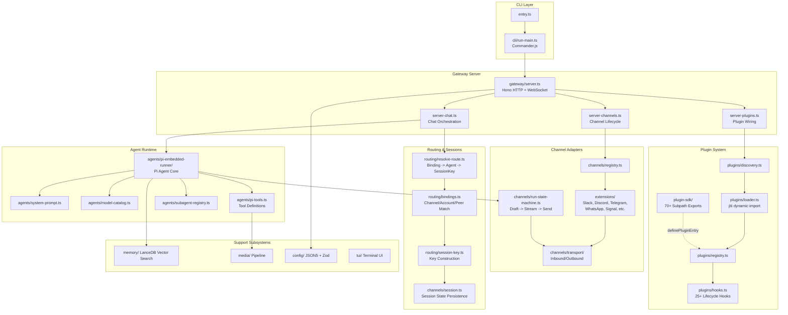
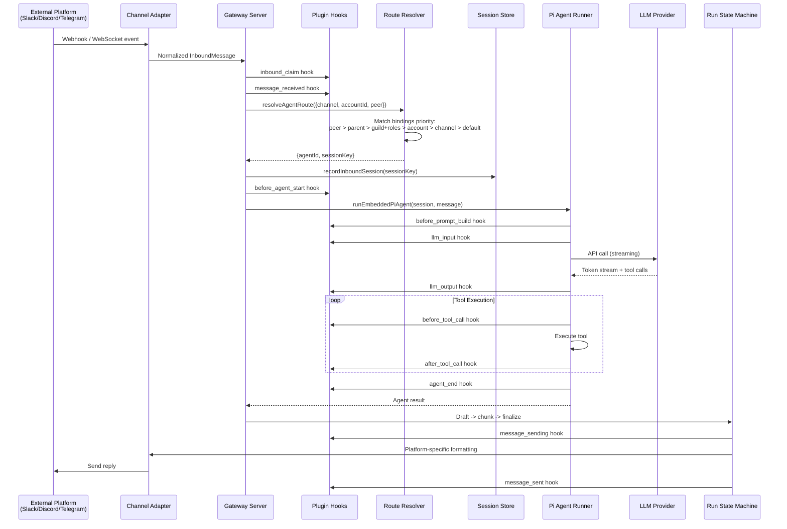
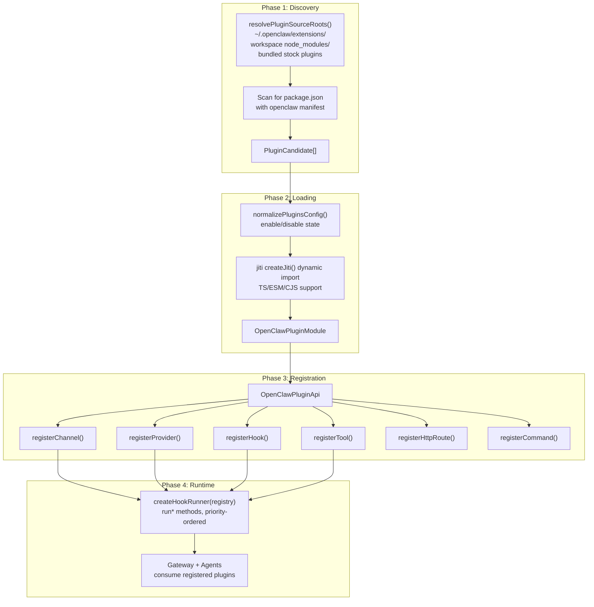
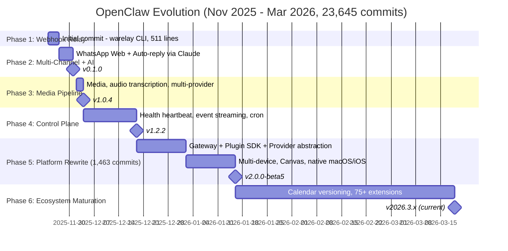
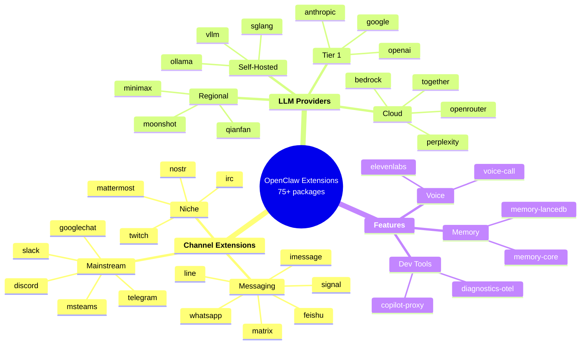
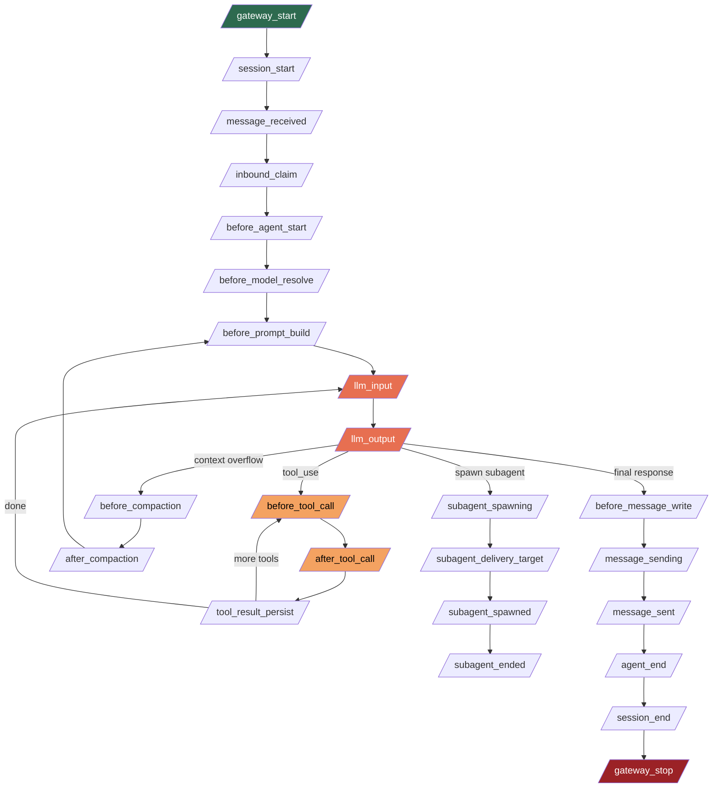
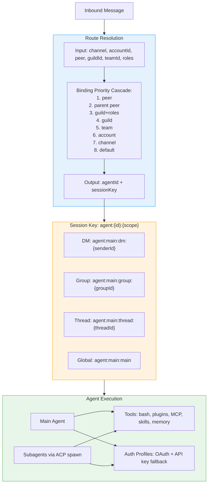
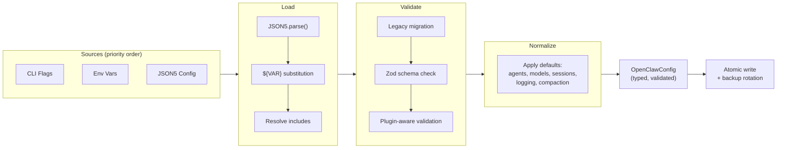

# OpenClaw Architecture & Operating Principles — Visual Guide

A comprehensive visual knowledge transfer covering every major subsystem, the project's evolution, and design principles.

---

## Diagram 1: System Architecture Overview

---

## Diagram 2: Message Flow Pipeline (Sequence)

---

## Diagram 3: Plugin System Lifecycle

---

## Diagram 4: Project Evolution Timeline

---

## Diagram 5: Extension Ecosystem Map

---

## Diagram 6: Hook Lifecycle Flow

---

## Diagram 7: Agent & Session Architecture

---

## Diagram 8: Configuration & Validation Pipeline

---

## Diagram 9: Design Principles & Build Order (Teaching Map)

```mermaid
graph TB
    CORE(("OpenClaw<br/>Design Principles"))

    CORE --> ADAPTER["Adapter Pattern<br/>Channels & Providers are<br/>interchangeable adapters"]
    CORE --> PLUGIN["Plugin-First<br/>Even bundled channels<br/>are plugins. Core is thin."]
    CORE --> HOOKS["Hook-Driven<br/>25+ lifecycle hooks replace<br/>tight coupling & inheritance"]
    CORE --> SESSION["Session Isolation<br/>Concurrent users never<br/>interfere. Key = scope."]
    CORE --> CONFIG["Config-as-Code<br/>JSON5 + Zod schemas =<br/>human-friendly + type-safe"]
    CORE --> BOUNDARY["Strict Boundaries<br/>70+ SDK subpaths prevent<br/>cross-cutting imports"]
    CORE --> EVENT["Event-Driven<br/>Message pipeline with<br/>hooks at every stage"]

    subgraph BUILD["Recommended Build Order for Similar System"]
        direction LR
        B1["1. Simple<br/>webhook relay"] --> B2["2. Channel<br/>adapter interface"]
        B2 --> B3["3. Session key<br/>+ routing"]
        B3 --> B4["4. Config system<br/>+ Zod validation"]
        B4 --> B5["5. Plugin lifecycle<br/>discover->load->register->run"]
        B5 --> B6["6. Hook system<br/>+ tool registry"]
        B6 --> B7["7. Multi-agent<br/>+ subagent spawn"]
    end

    CORE --> BUILD

    style CORE fill:#e8eaf6,stroke:#3F51B5,stroke-width:3px
    style BUILD fill:#efebe9,stroke:#795548,stroke-width:2px
```

---

## Key Files Reference

| Component | File Path |
|-----------|-----------|
| Entry point | `src/entry.ts` |
| CLI routing | `src/cli/run-main.ts` |
| Gateway | `src/gateway/server.ts`, `server-chat.ts` |
| Route resolver | `src/routing/resolve-route.ts` |
| Session keys | `src/routing/session-key.ts` |
| Plugin discovery | `src/plugins/discovery.ts` |
| Plugin loader | `src/plugins/loader.ts` |
| Plugin registry | `src/plugins/registry.ts` |
| Hook system | `src/plugins/hooks.ts` |
| Agent runtime | `src/agents/pi-embedded-runner.ts` |
| Agent scope | `src/agents/agent-scope.ts` |
| Config loader | `src/config/io.ts` |
| Config types | `src/config/types.*.ts` (37 files) |
| Plugin SDK | `src/plugin-sdk/` (70+ subpaths) |
| Channel plugins | `extensions/*/` (75+ extensions) |
